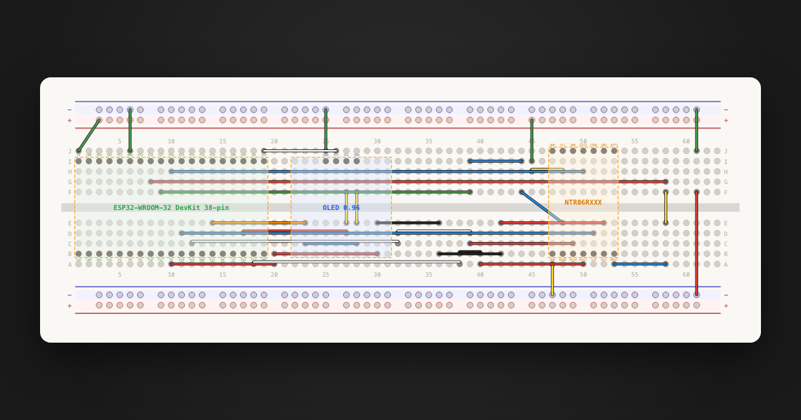

# Breadboard

A breadboard planner that let's you create and share neat wiring plans:

https://breadboard.safaorhan.com/

You can define the jumper colors and lengths you have so that you don't have to search which jumper to use where to have exactly fitting wiring.

You can share the wiring diagrams you have with your friends thanks to import and export projects feature.



## What it does

- A 63-column breadboard with the usual two power rails and the A–J pin grid.
- A small starter library of common modules, plus a one-click flow for
  defining your own when something's missing.
- Wires that snap to holes and get colored automatically based on their
  length, using a real jumper kit's color/length mapping.
- Multiple named projects, undo/redo, import/export to a portable JSON
  format, light/dark theme.
- Everything is local: no account, no server. The app is a single static
  bundle and your data sits in IndexedDB.

## Using the app

### Place a component

1. Click the **+** button in the floating action bar at the bottom of the
   canvas.
2. Pick a component from the library, or click **Create component** to
   define one inline (name, height in pitch units, and the pin names for the
   top and bottom rows).
3. The component follows the cursor; click on the board to drop it. Press
   `Esc` while placing to cancel.

Once placed: drag to move, right-click for **Rotate** and **Lock**, use the
sidebar Components list to rename, recolor, hide, or delete instances.

### Draw a jumper

Click any hole on the board to start a wire, then click a second hole to
finish it. The two holes are now electrically connected. Click an existing
wire to select it, then `Delete` to remove it. Holding a wire endpoint and
dragging lets you reroute either end.

The right-hand **Connections** panel groups holes into electrical nets so
you can see at a glance which pins end up joined.

### Jumper sets and wire colors

A *jumper set* is the bag of jumpers you own in real life. Each entry maps
a length (in breadboard pitch units, i.e. number of holes between centers)
to a color. The app ships with one preset:

- `common-140-piece` — the ubiquitous 140-piece kit with lengths 1–10 plus
  20, 30, 40, 50.

When you draw a wire, the app computes its Euclidean length in pitch units
and looks up the nearest matching jumper (±0.5 tolerance). If a match
exists, the wire renders in that color; if not, it falls back to a
**copper** color, signaling "you don't have a jumper this length — you'd
need to cut one." Switching the active jumper set re-colors every wire on
the board.

Click the **list** icon in the action bar to switch active sets or
**Create jumper set** to build your own (give it a name, then add `length` and `color` rows). Custom sets live in IndexedDB; the preset is reseeded
from `lib/jumper-sets/` on every page load.

### Save, export, import

Saves happen automatically — every edit goes to IndexedDB and is mirrored
across tabs on the same origin via `BroadcastChannel`.

To share a project: open the **project menu** (the chevron next to the
project name) and choose **Export**. You get a `.json` file containing the
placed components, wires, the active jumper set id, and definitions of
any non-standard components used.

To open someone else's file: **Import** from the home screen or the
project menu, select the `.json`. If the file references components that
aren't already in your library, you'll be asked whether to import them too.

### Other niceties

- `Cmd/Ctrl+Z` / `Cmd/Ctrl+Shift+Z` for undo/redo.
- Drag the sidebar/right-panel handles to resize them.
- Light/dark theme toggle in the footer.
- The thumbnail on each project card is generated from the actual board
  layout and cached.

## Contributing

The standard library — components, jumper sets, and example projects —
lives in [`lib/`](lib) as plain JSON. Adding to it is a PR-only flow:
drop a new file in the right subdirectory, and Vite picks it up at
build time via `import.meta.glob`. Bump `SEED_VERSION` in
[`src/db.ts`](src/db.ts) so existing users' caches re-seed the new entry
on their next load.

### Suggesting a component

1. Create `lib/components/<your-component>.json`. Use a slug-style `id`
   (lowercase, hyphenated) — not a UUID. Existing files are the
   reference.
2. Fields:
   - `id` — unique slug, e.g. `"ssd1306"`.
   - `name` — display name shown in the inserter.
   - `colSpan` — width of the component's footprint, in columns.
   - `rowSpan` — height in pitch units (the same units as ROW_Y_UNITS;
     practically: how many rows tall the component is from the top edge
     to the bottom edge).
   - `pins[]` — each pin has `name`, `col` (0-based offset from the
     left edge of the footprint), and `row` (`"top"` or `"bottom"`).
3. Sanity-check it by opening the app locally and inserting your
   component — pin positions match what you defined.

Example, a fictitious 3-pin sensor that sits across 5 columns:

```json
{
  "id": "my-sensor",
  "name": "MY-SENSOR-XYZ",
  "colSpan": 5,
  "rowSpan": 3,
  "pins": [
    { "name": "VCC",  "col": 1, "row": "top" },
    { "name": "DATA", "col": 2, "row": "top" },
    { "name": "GND",  "col": 3, "row": "top" }
  ]
}
```

You can also export a component you built in-app via the library list
(it'll come out with a UUID `id`; rename the file and swap the UUID for
a slug before PR'ing).

### Suggesting a jumper set

1. Create `lib/jumper-sets/<kit-name>.json`.
2. Fields:
   - `id` — string starting with `preset-jumper-set-` followed by a
     slug, e.g. `"preset-jumper-set-amazon-65-pack"`.
   - `name` — display name (e.g. "Amazon 65-piece").
   - `jumpers[]` — each entry is `{ "color": "#rrggbb", "pitch": N }`.
     `pitch` is the spacing in holes the jumper bridges; `color` is the
     hex color of that length in the real kit. Pitches must be unique
     within a set.

Try to match the colors of the actual physical kit as closely as you
can — that's the whole point.

### Suggesting an example project

Example projects appear under "Examples" on the home screen. They're
templates: clicking one creates a fresh project pre-populated with the
layout.

1. Build the project in the app, then **Export** it.
2. Save the file as `lib/projects/<slug>.json`.
3. Edit it:
   - Add a short `"description"` field — it shows under the name on the
     card.
   - If every component used is already in the standard library, remove
     the embedded `componentDefs` array (most examples don't need it).
     If your example uses a component that isn't in the standard library
     yet, either land that component first or keep the `componentDefs`
     array so the example is self-contained.

That's it — open a PR with the new file(s). For larger changes (new
features, refactors, UX work) feel free to open an issue first to talk
through the approach.

## Future improvements

The standard component library is intentionally small today. A natural
next step is to grow it by adapting parts from the [Fritzing open-source
parts library](https://github.com/fritzing/fritzing-parts) — Fritzing has
years of community-curated breadboard footprints under an open license, and
most of them map cleanly onto the JSON shape this app uses.

Other things worth building:

- **Through-hole components on the board itself**: wire-like parts whose
  two leads land in arbitrary holes — LEDs, resistors, capacitors, diodes,
  and so on. Today everything is treated as a rectangular module with a
  fixed footprint, so a resistor across two holes doesn't have a great
  representation.
- **Three-legged components**: transistors, voltage regulators, and other
  TO-92/TO-220-style parts that straddle three adjacent rows. These need a
  slightly different placement and rotation model than the current
  rectangular module.
- **Better component-creation UX**: the inline "Create component" form is
  a minimum viable thing. It could grow visual pin editing, drag-to-place
  pins on a footprint preview, and import-from-image flows.
- **Different breadboard variants**: half-size, full-size, mini, and
  solderable PCBs that follow the same hole topology. Right now the
  63-column geometry is hard-coded.
- **Stacked breadboards for larger projects**: many real builds span two
  or three boards snapped together, with rails shared across the seam.
  Modeling that would let bigger circuits live in one project.

If one of these speaks to you, open an issue to scope it before diving in
— some of them are tractable as small PRs, others are deeper changes to
the board model.

## Run locally

```bash
git clone https://github.com/safaorhan/breadboard.git
cd breadboard
npm install
npm run dev
```

Vite serves the app at `http://localhost:5173/` by default. Other
scripts:

- `npm run build` — production build into `dist/`.
- `npm test` — unit tests via Vitest.

The repo deploys to GitHub Pages on every push to `main`, via the
workflow in [`.github/workflows/deploy.yml`](.github/workflows/deploy.yml).

## Tech

- [Vite](https://vitejs.dev/) + TypeScript, no framework.
- Rendering is hand-rolled SVG (see [`src/render.ts`](src/render.ts)).
- Persistence via IndexedDB ([`src/db.ts`](src/db.ts)).
- The standard library is loaded with `import.meta.glob` so contributing
  is just a matter of dropping a JSON file in the right place.

## License

MIT — see [LICENSE](LICENSE).
